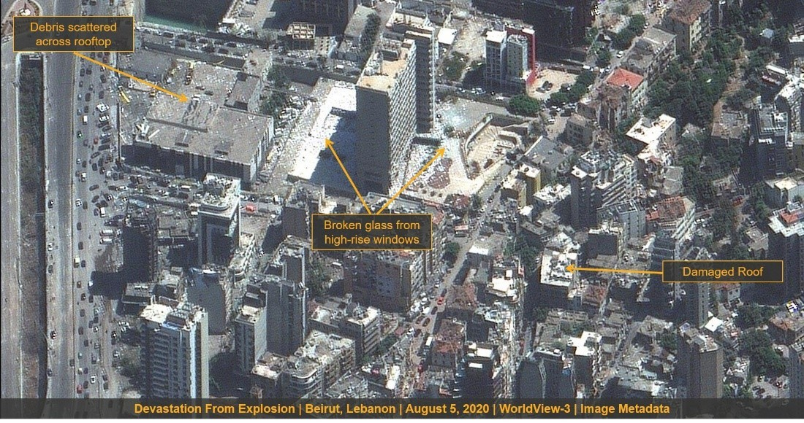

background-image: url(https://www.eoportal.org/api/cms/documents/163813/6584772/WorldView-3.jpg/f113f87f-2169-f476-a7de-9abf93d04dd7?t=1666154924074)

```{r setup, include=FALSE}
options(htmltools.dir.version = FALSE)
```

---
# Summary
.pull-left[1. WorldView-3 offers one of the <span style="color:darkblue;">**highest resolution commercial** </span> data products at 30 cm developed by Maxar (US) launched on August 13, 2014 <span style="color:darkblue;">**(still active)**</span>. 

2.  As WV-3 is a high-resolution satellite it can be utilized to :
<ul style="padding-left: 20px;"> 
  <li>Feature extraction</li>
  <li>Defense</li>
  <li>Tracking wildfires progression</li>
  <li>Assisting infrastructure planning</li>
  <li>Disaster</li>
  <li>Geology uses & environmental monitoring</li>
</ul>]

```{r echo=FALSE, out.width='40%', fig.align='right'}
knitr::include_graphics('img/WorldView3_Auto18.jpeg')


```
.pull-right[ Fig 1 : WorldView-3 instruments. source :  [EO Portal, 2023](https://www.eoportal.org/ftp/satellite-missions/w/WorldView3_080722/WorldView3_Auto18.jpeg)]

---
# Instruments
```{r echo=FALSE, out.width='100%', fig.align='center'}

```
Fig 2 : WorldView-3 sensors. source :  [Maxar Technologies, 2023](https://maxar-blog-assets.s3.amazonaws.com/uploads/blogImages/2014/08/Worldview-3-inforgraphic.jpg)
---

## Application : Humanitarian Assistance for Lebanon Red Cross

This photo is capturing right before and after <span style="color:darkblue;"> **ammonium nitrate explosion in Beirut's Port (Lebanon) **</span> on August 5, 2020. 
The prior explosion is on the left (09/6/2020),  after explosion is on the right (5/8/2020).

```{r echo=FALSE, out.width='70%', fig.align='center'}
knitr::include_graphics('img/WorldView3_AutoA.jpeg')
```

Fig 3 : Imagery before and after explosion. source : [Maxar Technologies, 2023](https://www.eoportal.org/ftp/satellite-missions/w/WorldView3_080722/WorldView3_AutoF.jpeg)

After the explosion happened, the overall on the ground insight of damaged area is needed to <span style="color:darkblue;"> **navigate the immediate aid**</span>. Maxar low latency & off-nadir agility satellite enables to provide > 2.500 sq km around Beirut's Port using WorldView-1, WorldView-2, and WorldView-3 <span style="color:darkblue;">**within 24 hours**</span>.
---
### WorldView-3 on Navigating Disaster Response
```{r echo=FALSE, out.width='55%', fig.align='center'}

```
Fig 4 : Building Damage Assessment. source :  [Maxar Technologies, 2020](https://maxar-blog-assets.s3.amazonaws.com/uploads/blogImages/Latency_Slide2.jpg)

```{r echo=FALSE, out.width='55%', fig.align='center'}

```
Fig 5 : Fire hotspots identification. source :  [Maxar Technologies, 2020](https://maxar-blog-assets.s3.amazonaws.com/uploads/blogImages/Latency_Slide3.jpg)
---
# Application : Tropical Forest's Species Classification 

.pull-left[1. Classification were conducted using <span style="color:darkblue;"> **Visible and Near-Infrared** </span> individually and combined with the <span style="color:darkblue;"> **Shortwave Infrared channel**</span>. Meanwhile the <span style="color:darkblue;">**panchromatic band**</span> enables texture analysis to detect crown structure

2. From this picture we could see that the texture analysis really helps to differentiate 2 species
<ul style="padding-left: 20px;"> 
  <li>Picture shows RGB composition (1.2 m)</li>
  <li>Panchromatic-Band </li>
  <li>Image combining A and B</li>
</ul>]

```{r echo=FALSE, out.width='49%', fig.align='right'}
knitr::include_graphics('img/application.jpg')
```

Fig 6 : Classificaition Findings. source :  M.P.Ferreiraetal., 2019
---
# Application : Hydrocarbon (HC) Detection
.pull-left[
- <span style="color:darkblue;">**Crude oil and natural gas** </span> are among components composed by hydrocarbons.
- Detecting HC using WorldView-3 is essential due to the **costly and small coverage** </span>  of airborne systems. 
- Meanwhile, the orbital intruments are seldom used due to the <span style="color:darkblue;">**lack of spectral bands** </span> .
- Despite the need for further research in aquatic environment, utilizing Remote Sensing imagery's global coverage is valuable for <span style="color:darkblue;"> **assisting and monitoring** </span>  large areas and diverse locations on Hydrocarbon application.]
 
```{r echo=FALSE, out.width='50%', fig.align='right'}

```
Fig 7 : Off-shore exploration. source: [ONYHM](https://www.onhym.com/en)

---
# Application : Hydrocarbon (HC) Detection

From this graph we could see the **performance** of different band ratios and RBD index in detecting HCs. 

```{r echo=FALSE, out.width='80%', fig.align='center'}

```
 source : Asadzadeh and De Souza Filho (2016)

 - WorldView-3 could be work well to detect various HC based on  <span style="color:darkblue;">**varied geoglogy** </span> .
 - The presence of <span style="color:darkblue;">**clay minerals** </span> can affect band that is sensitive to HC type
 - Hydrocarbone detection in  <span style="color:darkblue;">**dolomite soils** </span> is easier compared to clayey soil
 - <span style="color:darkblue;">**Heavier crude oil** </span> (API 29) is harder to detect.

---
# Additional Notes
1.  <span style="color:darkblue;"> **On Disaster Response :** </span>
 - Humanitarian aid needs **quick and high resolution** imagery. 
 - Satellite imagery is capable to support wide coverage, but often being **limited by its high latency access**. This limitation could be mitigated using off-nadir imaging but need extra corrections due to its angle. 
 - On small areas ** drone** could also become an alternative to provide immediate, real-time, and high resolution to support quick-decision making.

2. <span style="color:darkblue;"> **On Tropical Forest Species Classification:** </span> 
 - Image classification using remote sensing might help to identify the location of endangered species, which often hard to spot due to the dense vegetation and limited accessibility in forests.
---
# References
(Asadzadeh and De Souza Filho, 2016)
(Ferreira et al., 2019)

Asadzadeh, S. and De Souza Filho, C. R. (2016) ‘Investigating the capability of WorldView-3 superspectral data for direct hydrocarbon detection’, Remote Sensing of Environment, 173, pp. 162–173. doi: 10.1016/j.rse.2015.11.030.
Ferreira, M. P. et al. (2019) ‘Tree species classification in tropical forests using visible to shortwave infrared WorldView-3 images and texture analysis’, ISPRS Journal of Photogrammetry and Remote Sensing, 149, pp. 119–131. doi: 10.1016/j.isprsjprs.2019.01.019.


---