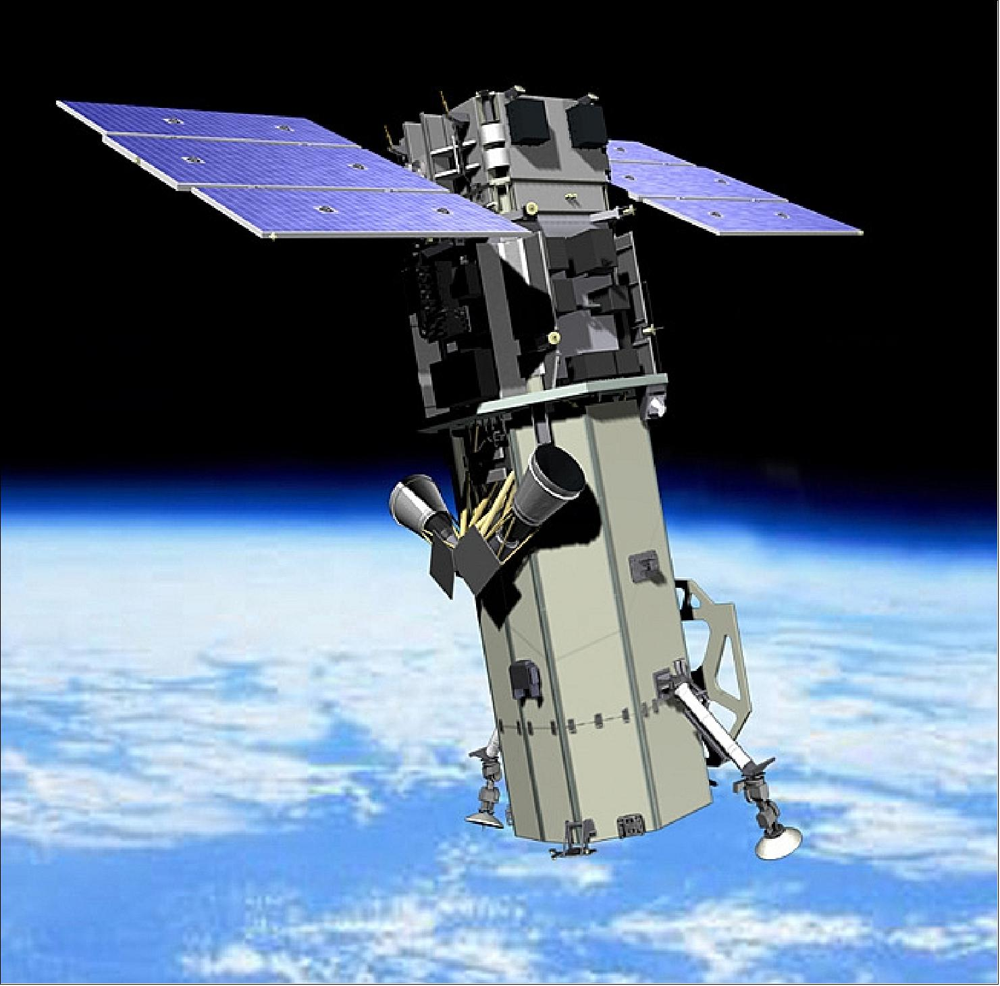
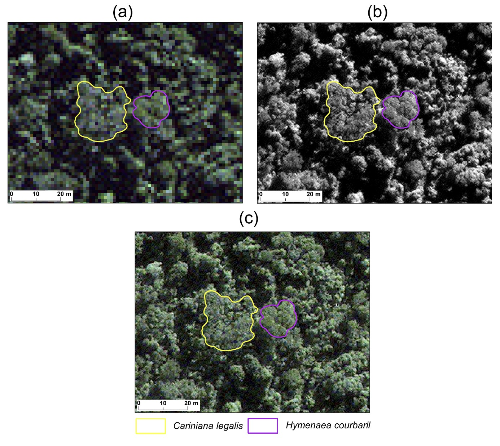

background-image: url(https://www.eoportal.org/api/cms/documents/163813/6584772/WorldView-3.jpg/f113f87f-2169-f476-a7de-9abf93d04dd7?t=1666154924074)

```{r setup, include=FALSE}
options(htmltools.dir.version = FALSE)
```

---
# Summary

.pull-left[1. WorldView-3 is an Earth observation and environmental monitoring satellite developed by Maxar in the United States,launched on August 13, 2014 (still active). 

2. It is closely resembles with WorldView-2, but WorldView 3 operates from a lower orbit at 617 km. It capable to collect up to 680.000 km2 per day

3.  WV-3 can be utilized to feature extraction, defenses, disaster response, able to track the progression of wildfires, and assist in urban infrastructure planning, geology uses, environmental monitoring]

```{r echo=FALSE, out.width='40%', fig.align='right'}



```
.pull-right[source :  [EO Portal, 2023](https://www.eoportal.org/ftp/satellite-missions/w/WorldView3_080722/WorldView3_Auto18.jpeg)]

---
# WorldView-3

The WV-3 Imager offers one of the highest resolution commercial data products at 30 cm```{r  echo=FALSE, out.width='60%', fig.align='center'}

```{r echo=FALSE, out.width='70%', fig.align='center'}
knitr::include_graphics('img/WorldView3_AutoA.jpeg')
```

source :  [Maxar Technologies, 2023](https://www.eoportal.org/ftp/satellite-missions/w/WorldView3_080722/WorldView3_AutoF.jpeg)

This photo is one of imagery revealed by WorlView-1, WOrldView-2, and WorldView 3 on August 5, 2020, capturing right before and after explosion in Beirut's Port. The prior explosion is on the left,  after explosion is on the right.
---
```{r echo=FALSE, out.width='100%', fig.align='center'}
knitr::include_graphics('img/Worldview-3-inforgraphic.jpg')
```
source :  [Maxar Technologies, 2023](https://maxar-blog-assets.s3.amazonaws.com/uploads/blogImages/2014/08/Worldview-3-inforgraphic.jpg)
---
# Application : Tropical Forest's Species Classification 

.pull-left[1. Classification were conducted using Visible and Near-Infrared  individually and combined with the Shortwave Infrared channel. Meanwhile the panchromatic band enables texture analysis to detect crown structure

2. From this picture we could see a) Picture shows RGB composition (1.2 m) b) Panchromatic-Band depicting 2 different species c) Image combining A and B
]

```{r echo=FALSE, out.width='45%', fig.align='right'}

```
source :  M.P.Ferreiraetal., 2019
---

# Application : Detecting Hydrocarbon


---